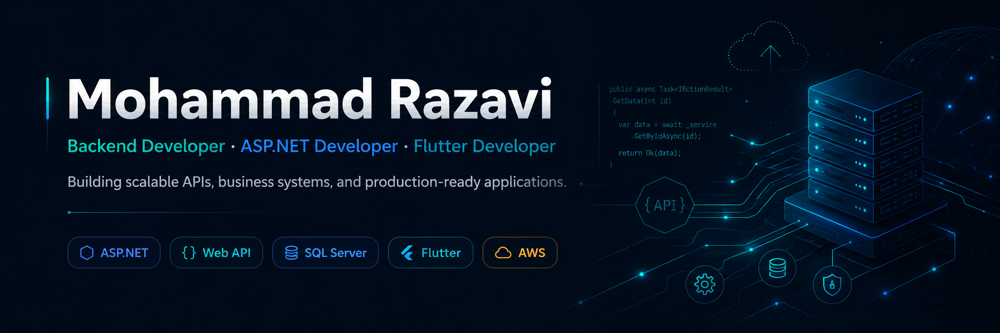

  

<h1 align="center">Hi, I'm Mohammad Razavi 👋</h1>

  <strong>Front-end Developer · UI/UX Designer · ASP.NET MVC Developer</strong>

  I design and build clean, business-focused web interfaces — from Figma to production.

  <a href="https://goljaam.com">Website</a> ·
  <a href="https://www.instagram.com/goljaam.firm/">Goljaam Instagram</a> ·
  <a href="https://www.instagram.com/mohmd_razvi/">Personal Instagram</a>

---

## About Me

I'm a developer and UI/UX designer focused on building practical web products, admin dashboards, and business automation systems.

My work sits between **design**, **front-end development**, and **ASP.NET-based web applications**. I care about interfaces that are clean, understandable, and useful in real business operations — not just nice screenshots.

- Founder / CTO at **Goljaam Firm**
- Focused on **front-end**, **UI/UX**, **ASP.NET MVC**, and **SQL Server**
- Interested in dashboards, automation panels, client portals, and production-ready web systems
- I like building products from the first Figma layout to the final deployed version

---

## What I Build

| Area | What I usually work on |
|---|---|
| **UI/UX Design** | Landing pages, dashboards, product pages, responsive layouts, design systems |
| **Front-end** | HTML, CSS, JavaScript, Bootstrap, responsive interfaces |
| **ASP.NET MVC** | Admin panels, business workflows, role-based systems, client portals |
| **Database** | SQL Server structure, reporting views, data-driven dashboards |
| **Product Thinking** | Turning client requirements into practical screens and workflows |

---

## Tech Stack

  
  
  
  
  

  
  
  
  
  

---

## Featured Focus

### Business Automation Systems
I work on internal systems that help businesses manage real workflows: users, roles, approvals, reports, tracking, and admin control.

### Admin Dashboards
I design and build dashboards that make complex data and manual operations easier to control.

### UI/UX + Front-end Implementation
I turn Figma layouts into responsive, clean, and usable interfaces for real client projects.

---

## GitHub Activity

  
  

---

## How I Think About Work

> Clean UI is not decoration.  
> It is how users understand the product faster.

I prefer practical design, simple structure, and code that supports the business process instead of fighting it.

---

## Contact

- Website: [goljaam.com](https://goljaam.com)
- Company Instagram: [@goljaam.firm](https://www.instagram.com/goljaam.firm/)
- Personal Instagram: [@mohmd_razvi](https://www.instagram.com/mohmd_razvi/)
